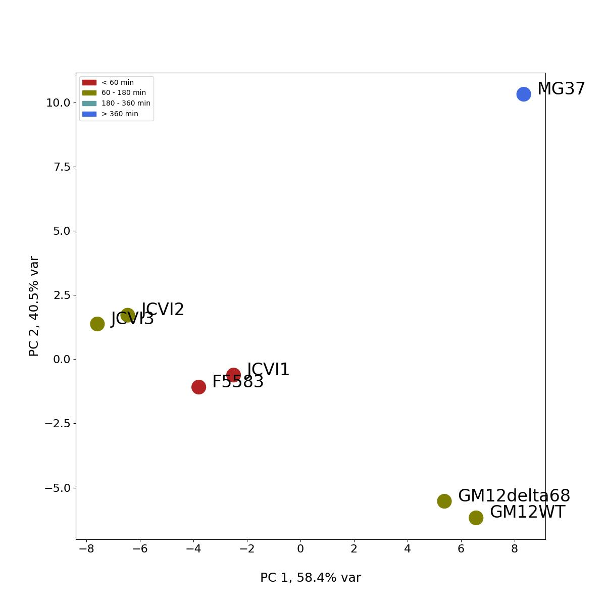

# Master's Thesis : Machine Learning Exploratory Analysis of Bacterial Genome Encoding Link to Growth Rate

data files (.fa) are obviously are missing, as they would take too much space.

examples of
.core (position, direction of core genes)
.stats (rank, position, direction and number of occurences of core genes)
.stats_all (rank, position, direction and number of occurences of pan genome)
are provided.
Only one example, however anyone with the skills and the motivation should be able to easily make it run with his own dataset.

## Description of the files :

### Scripts/
- genbank2fasta.pl, genbank2gff3.pl, run_clustal-omaga.sh : self explanatory
- rotate_origin.pl : rotate a sequence
- tetra_nucl.R : takes .fa, outputs tetranucleotide distribution as a .csv

### master_script.sh
needs joined_core (list of core genes) and repl_rates.csv (example)
needs annotatation files (.gff)

will a bunch of other scripts and generate a lot of different files...

### pipeline/scripts/

- pca_codon_usage.py




```python
def main():
    device = torch.device('cuda' if torch.cuda.is_available() else 'cpu')
    batch_size = 25
    n_epochs = 10
    load_weights = "_weights_2_iteration_40000.pth"

    train = Trainer(batch_size=batch_size, n_epochs=n_epochs, device=device,
                    load_weights=load_weights)

    train.train()

if __name__ == "__main__":
    main() 
```
