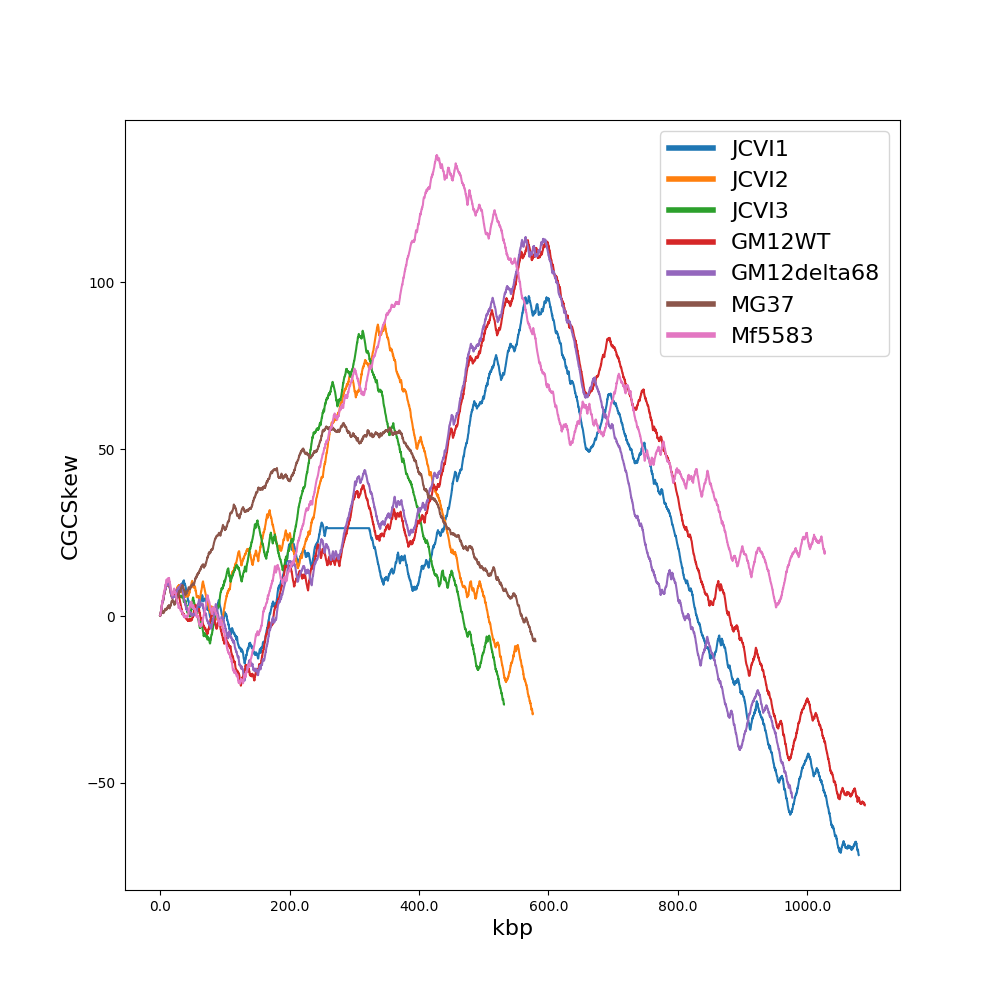
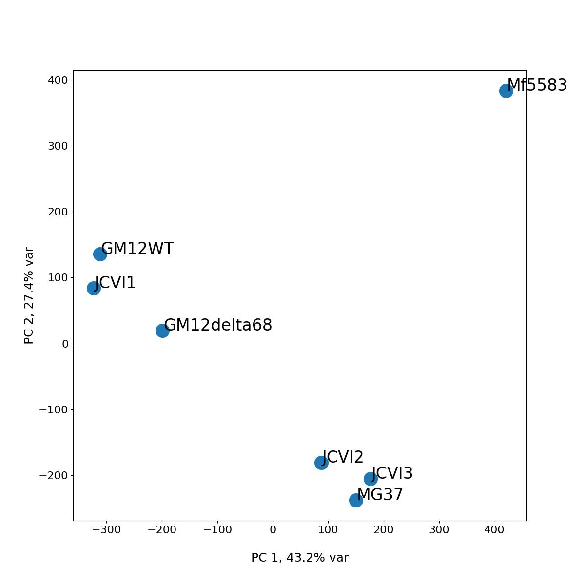
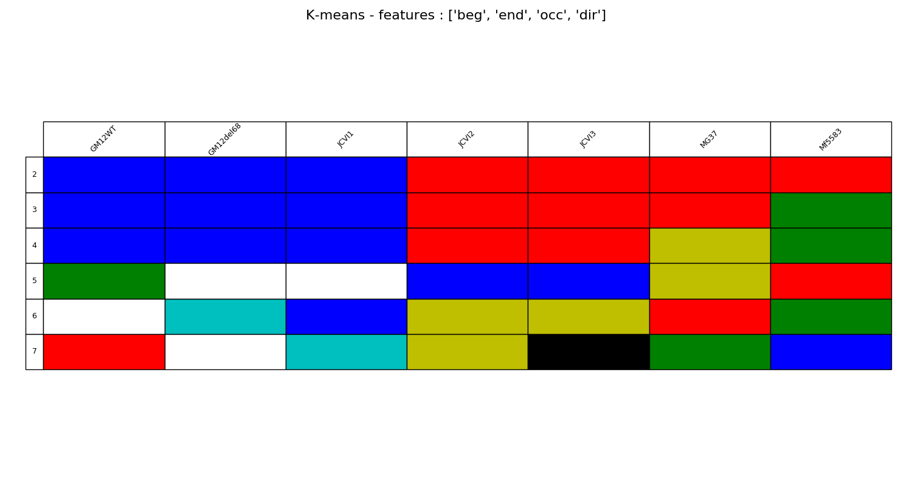
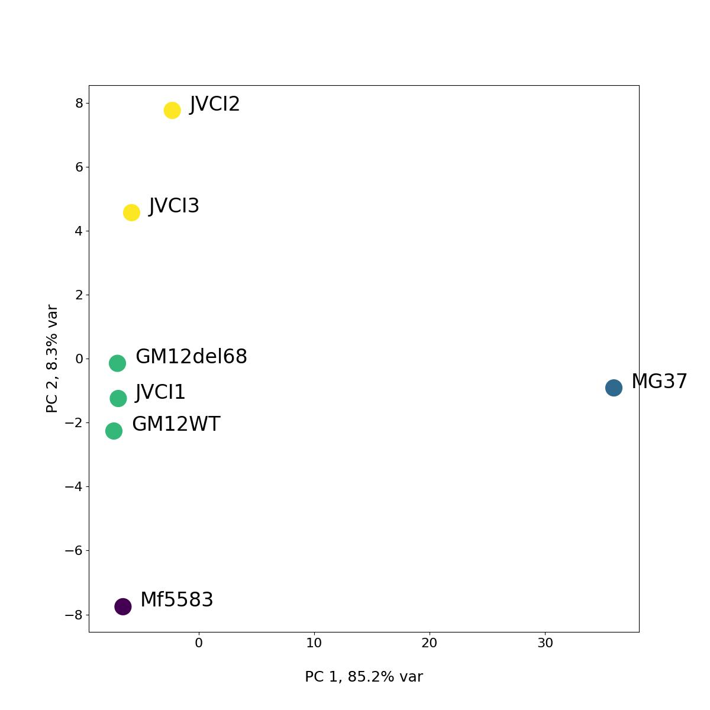
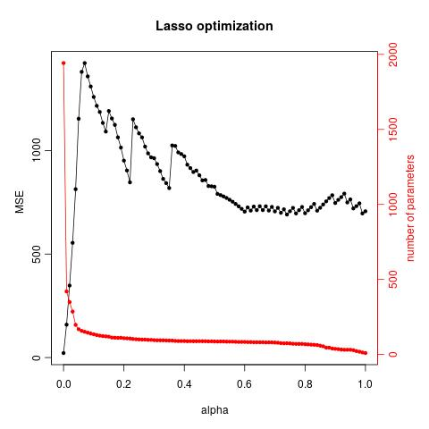
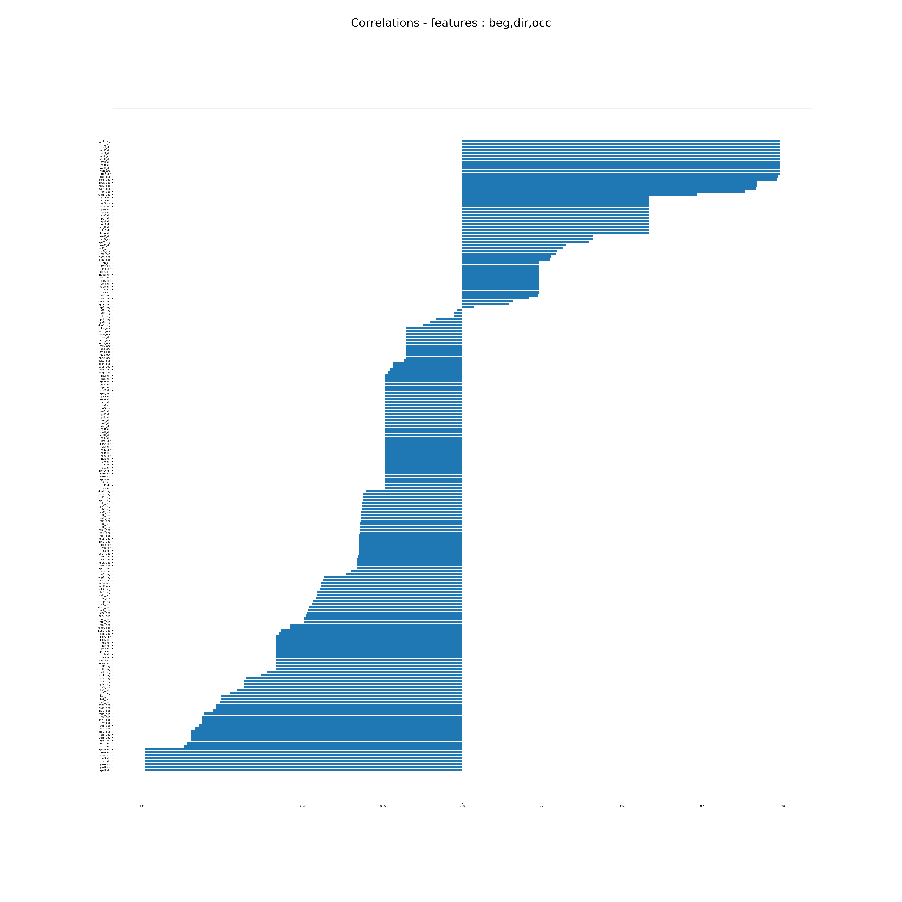
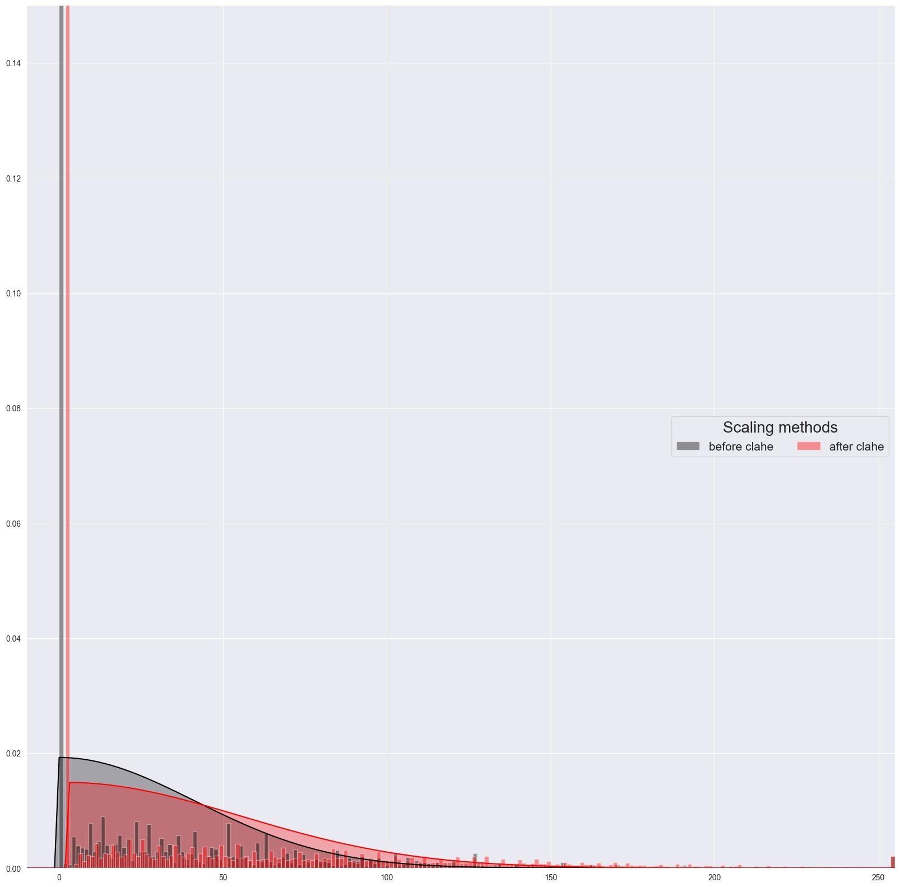
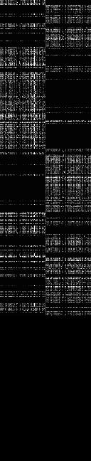

# Master's Thesis : Machine Learning Exploratory Analysis of Bacterial Genome Encoding Link to Growth Rate

data files (.fa) are obviously are missing, as they would take too much space.

examples of
.core (position, direction of core genes)
.stats (rank, position, direction and number of occurences of core genes)
.stats_all (rank, position, direction and number of occurences of pan genome)
are provided.
Only one example, however anyone with the skills and the motivation should be able to easily make it run with his own dataset.

## Description of the files :

### scripts/
- genbank2fasta.pl, genbank2gff3.pl, run_clustal-omaga.sh : self explanatory
- rotate_origin.pl : rotate a sequence
- tetra_nucl.R : takes .fa, outputs tetranucleotide distribution as a .csv

### master_script.sh
needs joined_core (list of core genes) and repl_rates.csv (example)
needs annotatation files (.gff)

will a bunch of other scripts and generate a lot of different files...

### pipeline/scripts/

- pca_codon_usage.py

same for dicodon usage

- GC_skew.py

as well as a pcoA based on this

- pca_kmeans.py

different clustering methods...

integrating it to the pca

- lasso.R

elastic net regression (testing different alpha values between 0 and 1 / ridge to lasso)

- correlations.py

pearson's between the features and the replication rates

- correlations_all.py

cross-correlations between the features, followed by hierarchal clustering

- get_codon_usage.py

get codon usage of all core genes. Generate a black and white image with genes on the y axis, codon usage on the x axis.

Can also generate display of the pixel densities with different normalization methods :

- generate_images.py

calls get_codon_usage.py for every sample, can also generate .npz for neural net training.

generate_images_wide.py does the same but differentiates between codons of different directions (128 pixels wide for 2x64 codons)

## Rest

there is bunch of other scripts that do similar things or pre-process the data. Not super pretty obviously but oh well, that's how it is.

- clean_core_genes.sh : removing some text from joined_core
- extract_infos.pl : extract features (number of occurences) from list of core genes 
- generate_trna_files.sh, tetranuncl_pca_kmeans.py : self-explanatory
- get_all_genes.sh, run_filter_core_genes.sh : parsing gff files
- get_core_genes.pl : extract core genome
- join_all_genes.py : extract pan genome

